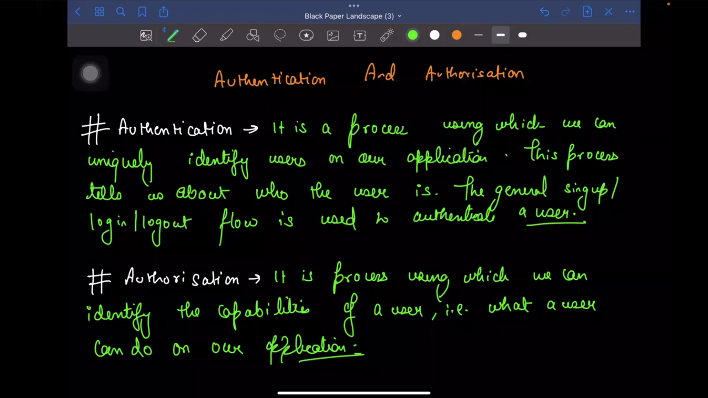
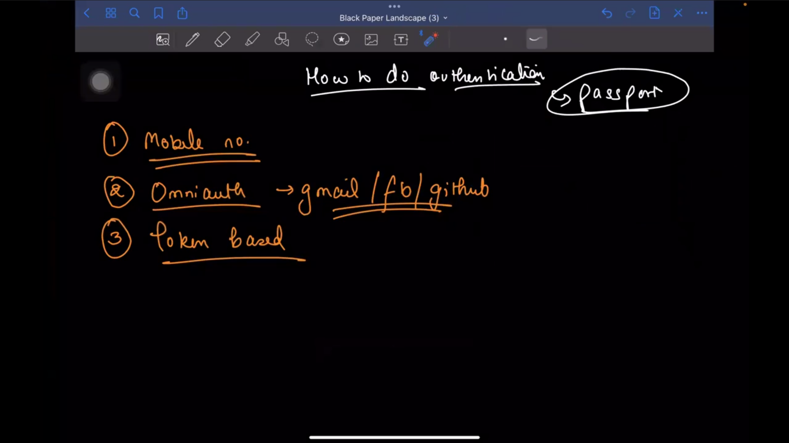
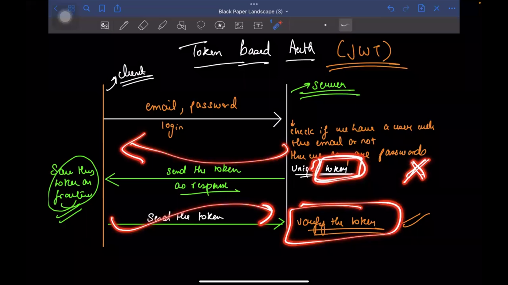
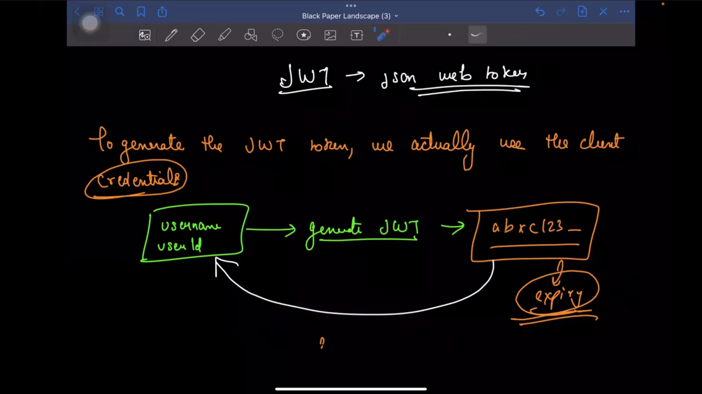
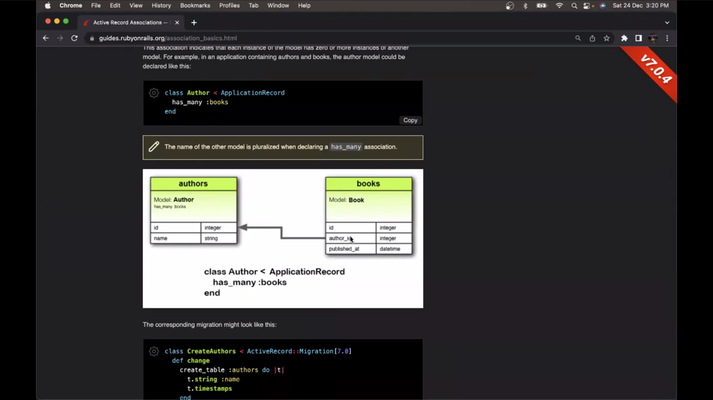
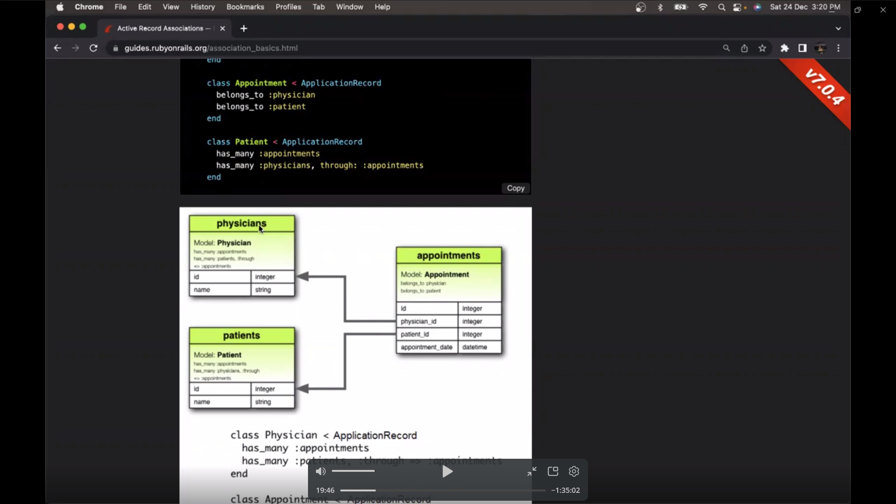
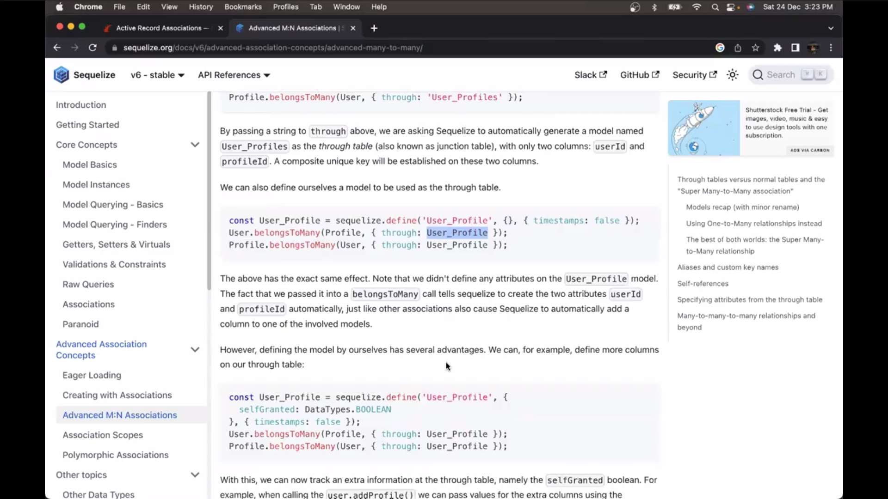
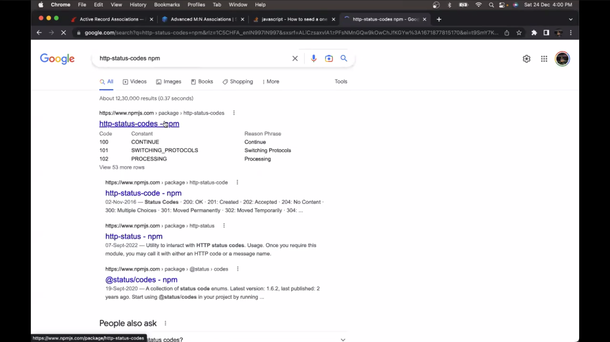
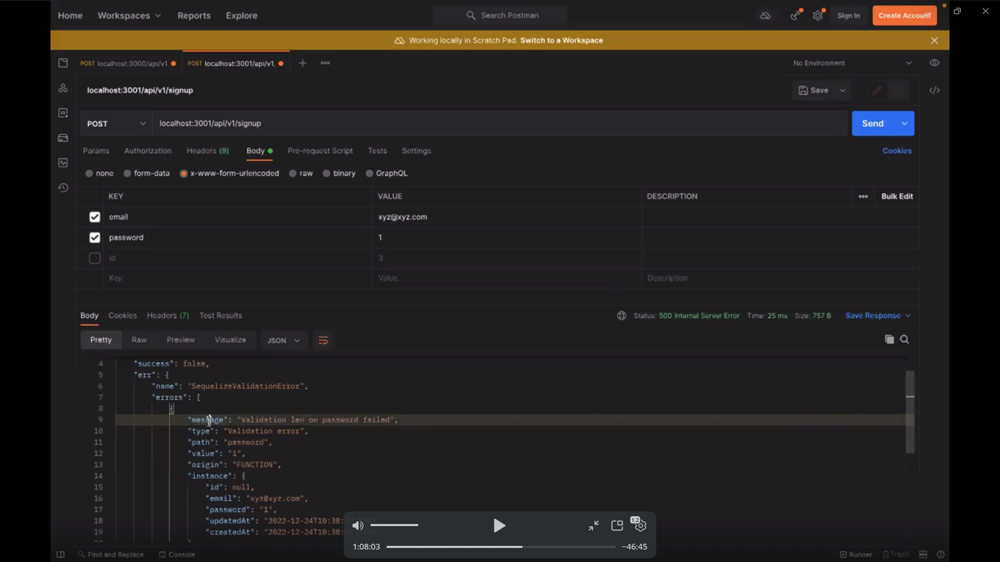
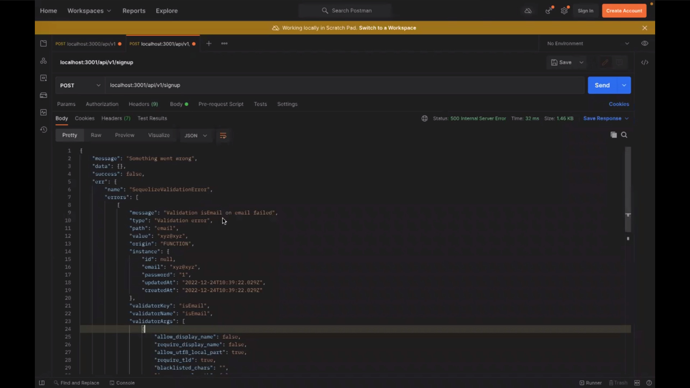

# Authentication And Authorisation (Roles):


# How to do authentication:
 
- - Mobile number

- - Omniauth   ->  Gmail/fb/github

- - Token based 








# Install Sequelize:
  - npm i mysql2
  - npm i sequelize sequelize-cli
  - npx sequelize init


  - npx sequelize db:create

  - npx sequelize db:migrate


  - npx sequelize model:generate --name User --attributes email:string,password:string

  - lets change the some changes like allowNull:false 

  - npx sequelize db:migrate


# bcrypt
 - is a password-hasing function
  - #  salt - random data that is used as an additional input to a one-way function that hashes data, a password or passphrase

# triggers sequelize
 - changes in user.js model 

# WebOTP API:
  - https://developer.mozilla.org/en-US/docs/Web/API/WebOTP_API


  - generate the otp phone and sms and whatsapp


# Adding auth logic to auth service post Registration:

 - # select 
 - https://sequelize.org/docs/v7/querying/select-in-depth


- # Jsonwebtoken npm:
  

- #  bearer token in postman

# Homework:
 - Try to implement verify email in auth service


# Authorisation:
 - is role of a user 
  - there can be a admin role 

  # rubyonrails - 

 - # Create a role Model

  - npx sequelize model:generate --name Role --attributes name:string

  

  

  

  # User Model:
   - static associate(models) {
      // define association here
      this.belongsToMany(models.Role,{
        through: 'User_Roles'
      })
    }

  # Role model:
  - static associate(models) {
      // define association here
      this.belongsToMany(models.User,{
        through: 'User_Roles'
      })
    }
 - it is not create role table 

- # npx sequelize db:migrate

- if the role_table is not create then do sync db in index.js
 - if(process.env.DB_SYNC){
            db.sequelize.sync({alert: true})
        }

    
- # create the seeds to roles

- # seed a particular seeder file sequelize

- # npx sequelize seed:generate --name add-roles:

 ```
     await queryInterface.bulkInsert('Roles', [
      {
        name: 'ADMIN',
        createdAt: new Date(),
        updatedAt: new Date()
      },
      {
        name: 'CUSTOMER',
        createdAt: new Date(),
        updatedAt: new Date()
      },
      {
        name: 'AIRLINE_BUSINESS',
        createdAt: new Date(),
        updatedAt: new Date()
      }
    ], {});
 ```

 - after the change the db
 - # npx sequelize db:seed --seed 20250610124659-add-roles.js  (file name)


# Dealing with Many-to-Many Associations in Sequelize:

 https://medium.com/@tavilesa12/dealing-with-many-to-many-associations-in-sequelize-bddc34201b80


# http-status-codes npm 

- npm i http-status-codes



https://www.npmjs.com/package/http-status-codes


# console.log(error)
 - error object run time error

 

 


# Class Error:
 -  
 


# Homework Custom message error:
```
    Implement custom error message Classes and use them in auth service 
```


# Building the next microservice:
 - 