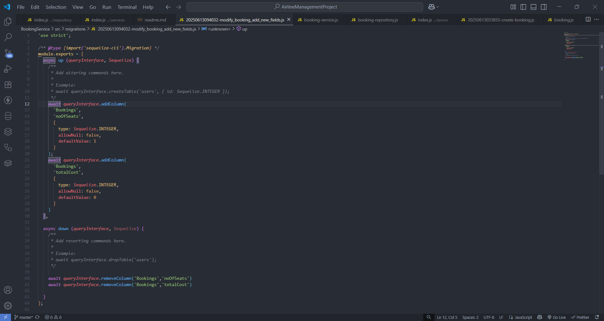

 # create express project 
  - npm int -y

  # npm i express body-parser http-status-codes mysql2 sequelize sequelize-cli nodemon dotenv

  # Morgan 
   - https://www.npmjs.com/package/morgan

   - HTTP request logger middleware for node.js

   - # npm i morgan

# set up of sequelize:
 - npx sequelize init

  - # src/config/config.json 
  - change the config folder in config.json inside the insert the database creadentions and give the databases name

  - # step 2:
   - npx sequelize db:create
   - then it create the database in the config.json metioned name

  - Database BOOKING_DB_DEV created

 # setup the route file and in index.js server file

 # after sync the db setup

 # error mdn stack trace:
  - https://developer.mozilla.org/en-US/docs/Web/JavaScript/Reference/Global_Objects/Error/stack

  # Created the error files
  - app-error
  - service-error
  - validation-error

  # enum in sequelize:
   - https://sequelize.org/api/v6/class/src/data-types.js~enum

   # try to setup the sequelize 
   - # create model
    - npx sequelize model:generate --name Booking --attributes flightId:integer,userId:integer,status:enum

   -  changes in migration and model  like allowNull : false

   - i changed the model and migration

   - # npx sequelize db:migrate

   - 0250613033855-create-booking: migrating =======
   == 20250613033855-create-booking: migrated (0.063s)

# update the model of booking and add the booking price 
- then we migrate the sync to db
   
# we need to create the new migration new model

- # npx sequelize migration:create --name modify_bookings_add_new_fields 
- it will create a migration file and write the queryInterfece.addColumn
  - C:\Users\jammu\Desktop\Projects\node\AirlineManagementProject\BookingService\src\migrations\20250613094032-modify_booking_add_new_fields.js

  

- # npx sequelize db:migrate

- then i changed the booking model noOfSeats and totalCost similar constrains

- then we sync the db once

- # if undo the migration also
 - npx sequelize db:migrate:undo

 - revert the lost migration

- # in mysql cmd
  - # Delete the columns
  - alter table booking drop column noOfSeats
  - alter table booking drop column totalCost

# ---------------------------------------------------------------------------------------------------------------------------------------------------------
# Connecting Microservices using HTTP:
- install the axios 

# H/W:

- upadate booking api

# Winston:
- https://www.npmjs.com/package/winston
- it is used for good for logg the error like logges

# Complete the error handling in other services

# interservice communication

# ---------------------------------------------------------------------------------------------------------------------------------------

# setting Up Reminder service: