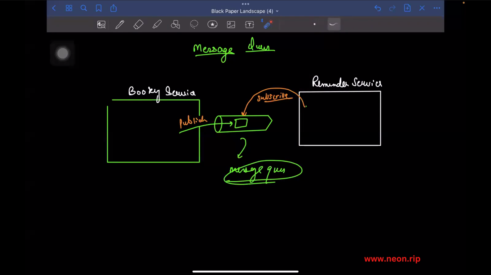
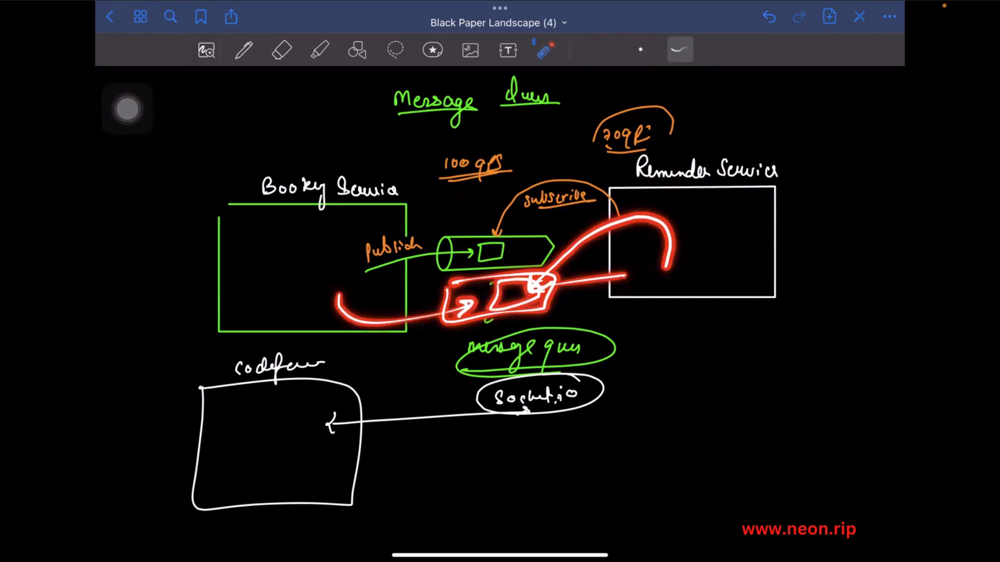
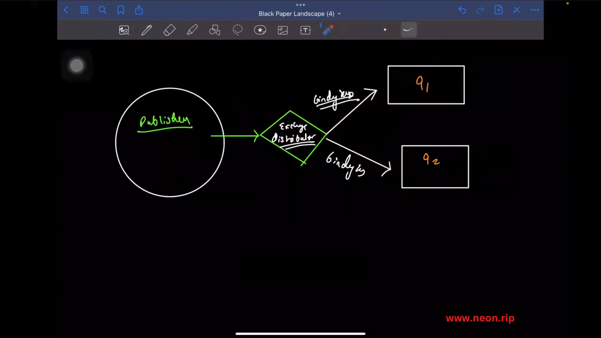
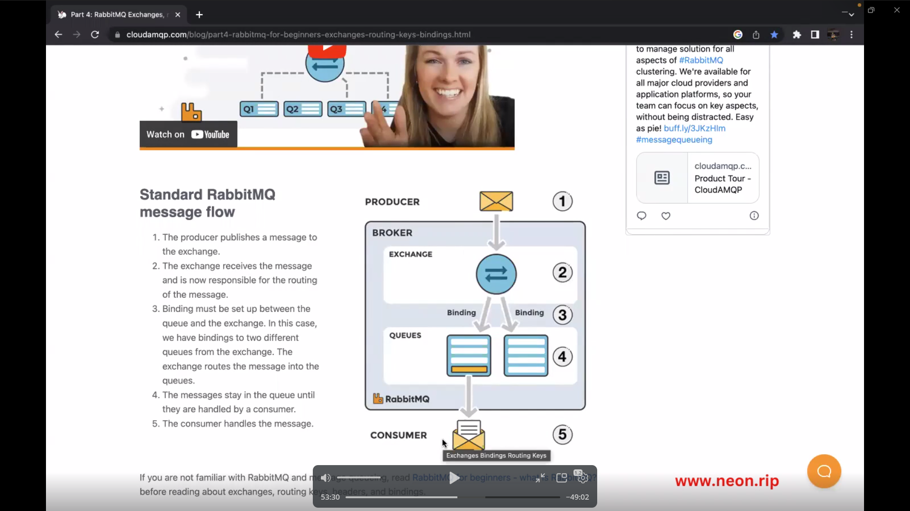
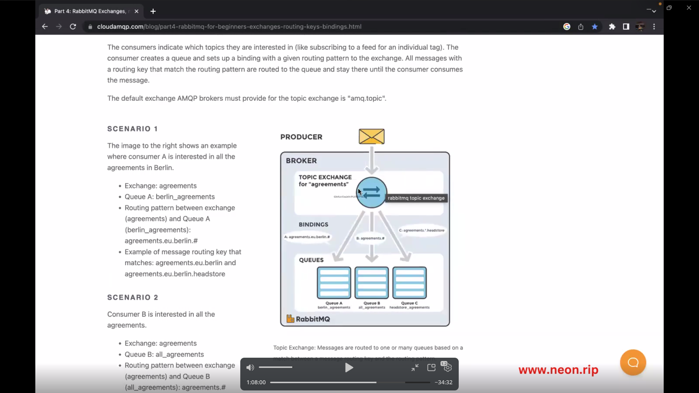

# setting Up Reminder service:  

# to send emails

### Setup 
# npm install express body-parser nodemon dotenv mysql2 sequelize sequelize-cli

# nodemailer
- npm i nodemailer
- SMTP servers

# SMTP transport
    - it support all domains like gmail,yahoo...
    - https://nodemailer.com/smtp

# twilio-node
- SMS message
- https://www.npmjs.com/package/twilio

# set up smtp api keys in gmail
- gmail setting
  - Home its we have search bar in app password
  - inside we set app name

  - go to security
    -
# CRON JOBS: schedule the time:
 - https://www.npmjs.com/package/node-cron

 - npm i node-cron

# ------------------------------------------------------------------------------------------------

### Adding Logic to Reminder Service:

# We need a model:
 - npx sequelize init
 - npx sequelize db:create
 - npx sequelize model:generate --name NotificationTicket --attributes subject:string,content:string,recepientEmail:string,status:enum,notificationTime:date

 - changes in migration file and model file like allowNull:false

 - npx sequelize db:migrate

# Cron in search of in GOOGLE
-  wrote cron to run every 5 minutes
- https://crontab.guru/every-5-minutes

# Rollback migration forgot the status values in one the value is defaukt to metion
- npx sequelize db:migrate:undo

# Research about the Django
- # Inside the Django admin panel

# node have adminJS is admin panel
- https://docs.adminjs.co/installation/plugins/express

# Message Queue:
 - # RabbitMQ  
  - https://www.rabbitmq.com/

# pdf creator npm package
 - https://www.npmjs.com/package/pdf-creator-node

# add ui templates for mail nodemailer:
- https://medium.com/@raghavendralacharya/sending-html-email-templates-with-images-using-node-js-and-nodemailer-719a1f1dc894

# H/W:
- bueatiful ui mail template
- interservice communication

# Queues:
/**
 *  Queues
 * 
 * [Service 1 (100qps) Publisher]       ---------> message queue [msg1, msg2, ... msg 100]  ----------> [Service 2 (20qps) Subscriber]
 * 
 * [Service 2 (Publisher)]        --------> message queue [msgs]    -----> [Service 1 (Subcriber)]
 * 
 */

/**
 * [input text 1]   -> [output text]
 * submit   -> [submssion text]
 */

# Message Queues:

# amQp:
- https://www.npmjs.com/package/amqplib

# binding_key:
 - 

