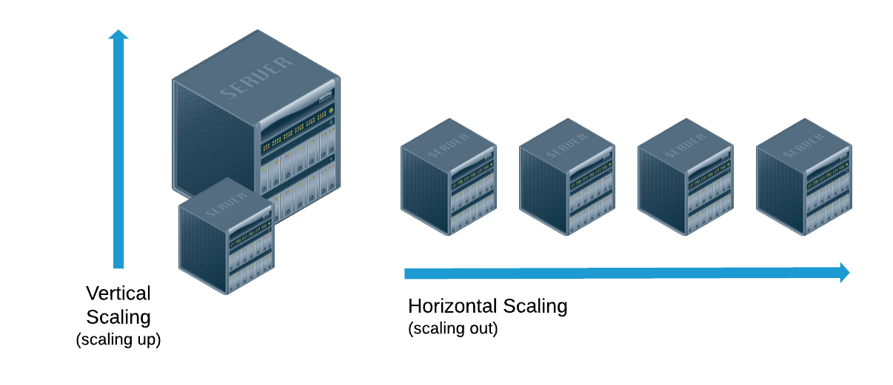
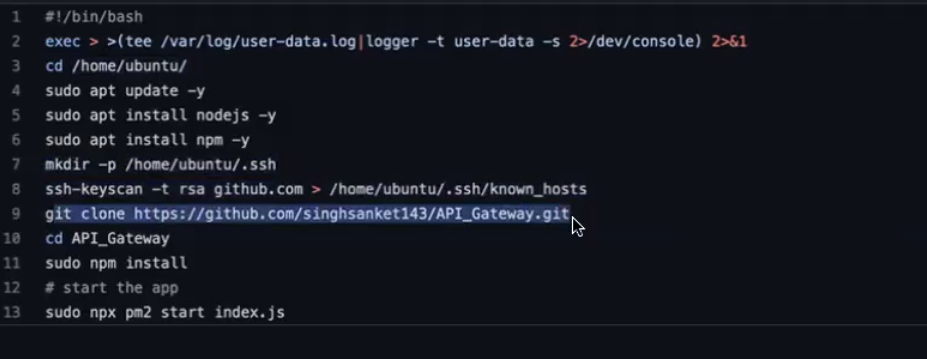

# ------------------------------------------------------------------------------------------------------------------------------------------------------------------
# Connecting Microservices using HTTP:

# amqp:

# H/W:
- kafka

# AWS:
- EC2 : 
- inside aws lunching instance make rule
- inBoundRule and outboundRule

- cmd or linx
- download/
    - greps awskey
    - inside peam file

- chmod 700 awskey.pem  the read and updet the 700 user

- ssh -v -i awskey.pem ubuntu@15.207.55.3

- now inside the aws now

- ubuntu@ip-172-31-0-29:~$

- ubuntu machine in first we update the machine
   - sudo apt-get update
- install nvm aws ec2

    - https://docs.aws.amazon.com/sdk-for-javascript/v2/developer-guide/setting-up-node-on-ec2-instance.html

    - curl -o- https://raw.githubusercontent.com/nvm-sh/nvm/v0.39.7/install.sh | bash

    - active the nvm
      - source ~/.bashrc or ~/.nvm/nvm.sh
      - nvm install 16

      - node -v
      - npm -v

- Go to github
  - copy the https url 
  - git clone  https://github.com/..../API_Gateway.git
  - 

- Go to inside the Repo
  - cd API_Gateway/

- ubuntu@ip-172-31-0-29:~/API_Gateways$ npm install

- node index.js
 - started running the server 3005

- if the serverc will run background:
  - package called PM2

  - PM2 - PROCESS MANAGER FOR NODE.JS
  - 

 - to install in local code like this
  - Developer/AirlineManagementProject/API_Gateway 
    - npm i pm2
    - push main branch in git

- after come the unbuntu:
 - git pull origin master

- unbuntu@ip-172-31-0-29:~/API_Gateway$  pm2 start index.js
- npm install -in the aws server

- - npx pm2 start index.js
- - npx pm2 stop index.js

### Autoscaling in AWS: 
- What is cloud : 

- ssh key to access key
`download folder`
- ls | grep awskey
- ssh -i awskey.pem ubuntu@3.110.44.156

- ubuntu@ip-172-31-12-128:~$  now in aws machine
- whomi
- ls

- make a new  file 
  - vim test.py
  - python3 test.py

- clone the API_Gateway/
 
- ubuntu@ip-172-31-12-128:~/API_Gateway/
- npx pm2 start index.js

### aws machine comfig
    -  cat /proc/meminfo
    -  cat /proc/cpuinfo

- whomi
- sd 
- two types of scaling 
 - Vectical scaling and Horizontal scaling 
 - 
- https://tse3.mm.bing.net/th/id/OIP.6EEqU6T1tRAKOb4novNT5AHaDN?r=0&rs=1&pid=ImgDetMain&o=7&rm=3

### Load Balancer:
# What is Load Balancer vs API Gateway

### AutoSclAwsScaling:

- some of instance ip config
- /downloads
  - ssh -i awskey.pem ubuntu@13.127..92.255

  - ubuntu@ip-172-31-5-176:~$ ls
      - API_Gateway
  -
  - ubuntu@ip-172-31-5-176:~$

## AWS:
 - # Auto Scaling groups:
   
   - Choose launch template or configuration
   - name: testingapigatewaygroup

   - Lunch template
    - select the autoDeployAPIGateway
    - next
     - next

  
# sudo apt install stress

# env config
