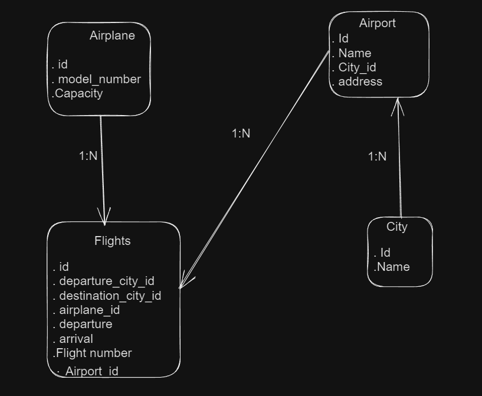
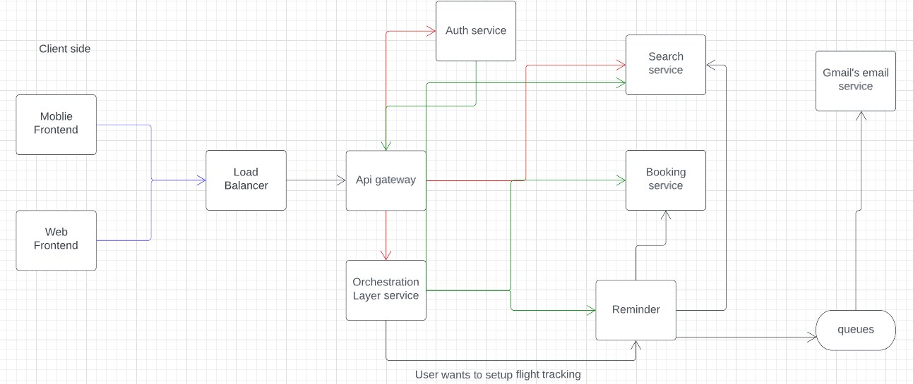

# Airline Backend System

## Objectives

We need to build a backend system that can support different features for an airline company. Our end user will be someone who wants to book flights and query about flights, so we need a robust system to help them give the best experience possible. This doc is solely going to focus on the backend part of the system. We want to prepare the whole backend
keeping the fact in mind the code base should be as maintainable as possible.

## Requirements

- A user should be able to search for flights one place to another.
- The user should be able to mention the source and destination details.
- The user should be able to select the date of the journey.
  - [V2] user should be able to search for return flights and multi-city flights.
  - The user should be able to select the class of the flights [Non-mandatory]
  - User should be able to select the no of seats they want to book [Non-mandatory]
- Now based on the above data, we will list down the flights.
- We should show our users the best avaliable flights at the top based on the time-period of flights and then based on the price.
- We need to support pagination so that we can list chunks of flights at one point in time.
- We should support filters of the flights based on the price, Departure time, Duration, Airline, and Stops.
- [v2] We can add support for more filters.
- A user should be able to book a flight considering that the user is registered on the platform.
- Users should be able to cancel a booking and then based on some criteria we can initiate a refund for them.
- Users should be able to request and book excess luggage for every flight.
- For making a booking, the user has to make a payment [dummy].
- Tracking flight price should be possible, the user should be notified about any price drops on any delays.
- User should be able to list their previous and upcoming flights.
- User should be able to download Boarding pass if they have done online check-in
- An online check-in mechanism should be supported
- Notifications via email for completing online check-in before 3 hours of departure.
- Notifications to users about any flights delay.
- User should be able to review the flight journey if and only if they have booked a flight.
- The review mechanism should involve a star rating along with a comment.
- While listing any flight we should also display the review of the flight.
- User should be able to authenticate to our system using email and password.
  - [v2] Support ticketing, where user can raise their queries.
  - Listing FAQ which will be static data.
  - [v2] prepare seat selection
  - Coupons for discounts and offers.

# Search And Flights Service

- Create Flights
- Delete Flights
- Update Flights
- Search Flights
  - Based on multiple filtration we search for flights
  - pagination
  

### Here is the LLD Design

# ------------------------------------------------------------------------------------------------------------------------------------------------------------------
# Connecting Microservices using HTTP:

# amqp:

# H/W:
- kafka

# AWS:
- EC2 : 
- inside aws lunching instance make rule
- inBoundRule and outboundRule

- cmd or linx
- download/
    - greps awskey
    - inside peam file

- chmod 700 awskey.pem  the read and updet the 700 user

- ssh -v -i awskey.pem ubuntu@15.207.55.3

- now inside the aws now

- ubuntu@ip-172-31-0-29:~$

- ubuntu machine in first we update the machine
   - sudo apt-get update
- install nvm aws ec2

    - https://docs.aws.amazon.com/sdk-for-javascript/v2/developer-guide/setting-up-node-on-ec2-instance.html

    - curl -o- https://raw.githubusercontent.com/nvm-sh/nvm/v0.39.7/install.sh | bash

    - active the nvm
      - source ~/.bashrc or ~/.nvm/nvm.sh
      - nvm install 16

      - node -v
      - npm -v

- Go to github
  - copy the https url 
  - git clone  https://github.com/..../API_Gateway.git
  - 

- Go to inside the Repo
  - cd API_Gateway/

- ubuntu@ip-172-31-0-29:~/API_Gateways$ npm install

- node index.js
 - started running the server 3005

- if the serverc will run background:
  - package called PM2

  - PM2 - PROCESS MANAGER FOR NODE.JS
  - 

 - to install in local code like this
  - Developer/AirlineManagementProject/API_Gateway 
    - npm i pm2
    - push main branch in git

- after come the unbuntu:
 - git pull origin master

- unbuntu@ip-172-31-0-29:~/API_Gateway$  pm2 start index.js
- npm install -in the aws server

- - npx pm2 start index.js
- - npx pm2 stop index.js

### Autoscaling in AWS: 
- What is cloud : 

- ssh key to access key
`download folder`
- ls | grep awskey
- ssh -i awskey.pem ubuntu@3.110.44.156

- ubuntu@ip-172-31-12-128:~$  now in aws machine
- whomi
- ls

- make a new  file 
  - vim test.py
  - python3 test.py

- clone the API_Gateway/
 
- ubuntu@ip-172-31-12-128:~/API_Gateway/
- npx pm2 start index.js

### aws machine comfig
    -  cat /proc/meminfo
    -  cat /proc/cpuinfo

- whomi
- sd 
- two types of scaling 
 - Vectical scaling and Horizontal scaling 
 - 
- https://tse3.mm.bing.net/th/id/OIP.6EEqU6T1tRAKOb4novNT5AHaDN?r=0&rs=1&pid=ImgDetMain&o=7&rm=3

### Load Balancer:
# What is Load Balancer vs API Gateway

### AutoSclAwsScaling:

- some of instance ip config
- /downloads
  - ssh -i awskey.pem ubuntu@13.127..92.255

  - ubuntu@ip-172-31-5-176:~$ ls
      - API_Gateway
  -
  - ubuntu@ip-172-31-5-176:~$

## AWS:
 - # Auto Scaling groups:
   
   - Choose launch template or configuration
   - name: testingapigatewaygroup

   - Lunch template
    - select the autoDeployAPIGateway
    - next
     - next

  
# sudo apt install stress

# env config
